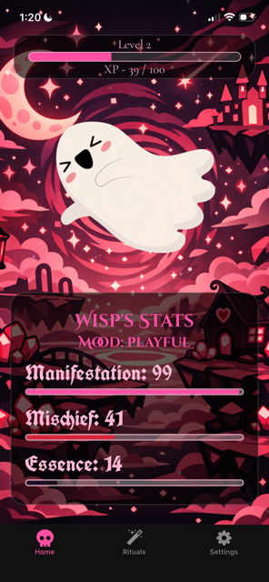
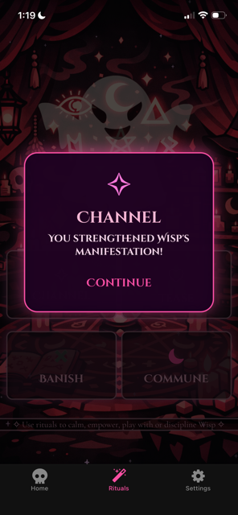
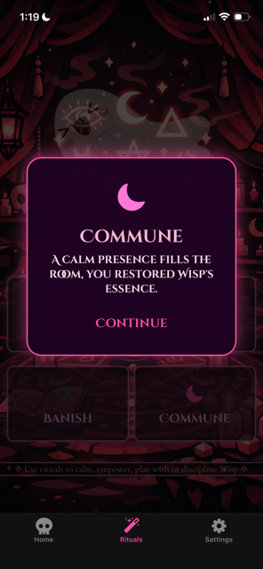
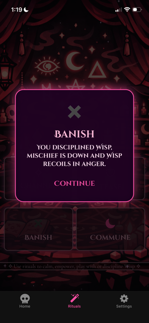
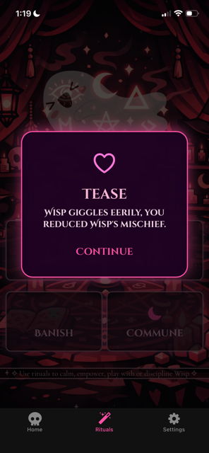
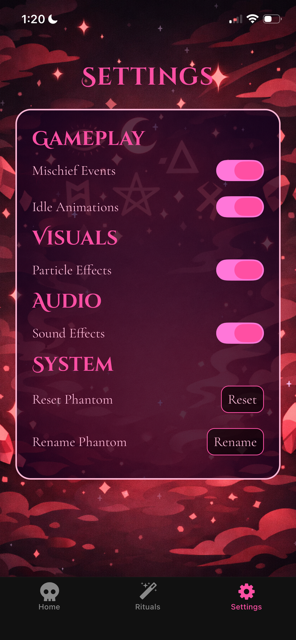

# Phantom Keeper

A cozy tamagotchi-like virtual mobile game with a spooky twist, built with React Native + Expo where you can care for, perform rituals with, and torment a pet phantom.

## Features

### Ghost Companion

- An animated phantom with multiple mood states:
  - Playful
  - Serene
  - Restless
  - Faint
  - Spiteful
  - Chaotic
- Mood changes based on player actions and stat decay.

### Stats System

The phantom has 4 core stats:

| Stat          | Description                                              |
| ------------- | -------------------------------------------------------- |
| Manifestation | How physically present the phantom is.                   |
| Mischief      | Determines how chaotic the phantom behaves.              |
| Essence       | The phantom's life force. Influences evolution and mood. |
| Mood          | The phantom's emotional state, dependant on other stats. |

Stats decay over time and are influenced by Rituals.  
Gameplay logic can be found in `src/redux/phantomSlice.js`

### Rituals

Perform supernatural actions to interact with your Phantom:

   
   
   
   

### Settings

